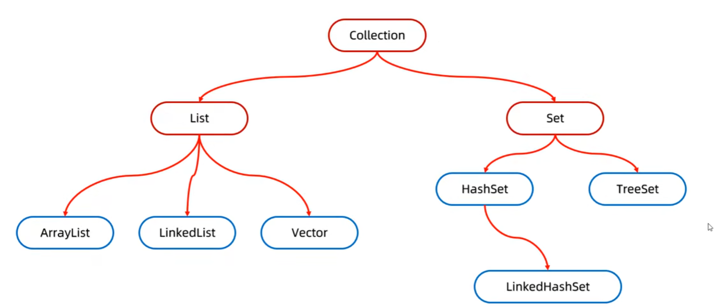
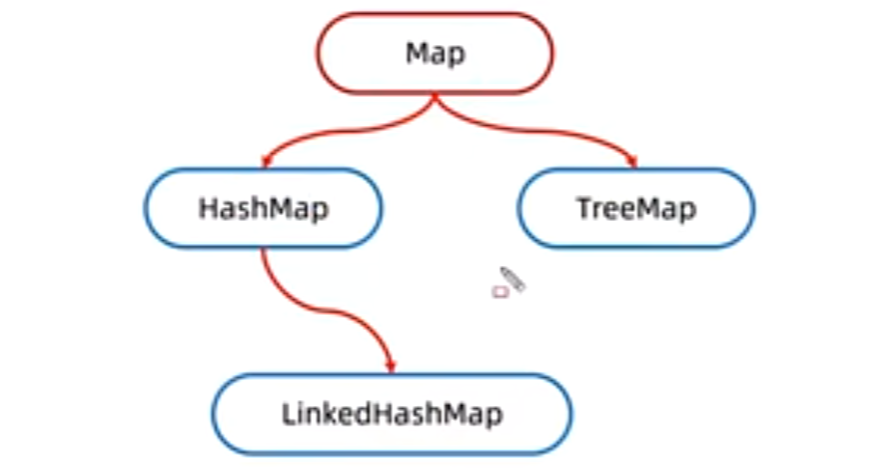
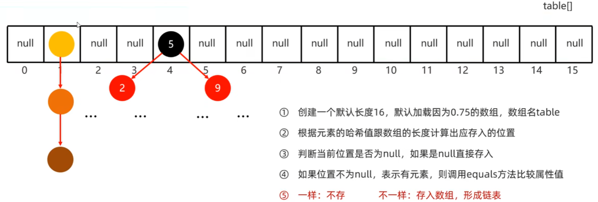
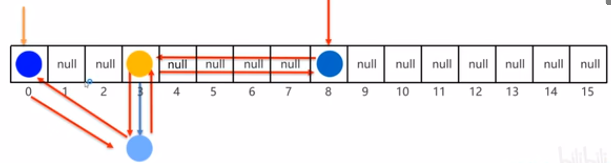

# Java集合框架

Java集合框架（Java Collections Framework）是Java核心库中用于存储和操作数据的重要模块，其设计遵循接口与实现相分离的原则。

## 1. Java集合的体系结构

Java中的集合分为两大类：单列集合和双列集合。

单列集合：



双列集合：




## 2. Collection接口

```java
public interface Collection<E> extends Iterable<E> {
}
```

`Collection`接口是单列集合的顶层接口，其中声明的方法是所有单列集合所共有的一些方法。

`Collection`接口中的常用方法有：

| 方法名                                       | 说明                                                         |
| -------------------------------------------- | ------------------------------------------------------------ |
| **boolean add(E e)**                         | 添加元素                                                     |
| **boolean remove(Object o)**                 | 删除元素                                                     |
| **boolean contains(Object obj)**             | 判断集合中是否包含指定的元素                                 |
| **boolean isEmpty()**                        | 判断集合是否为空                                             |
| **int size()**                               | 返回集合中元素的个数                                         |
| **void clear()**                             | 清空集合                                                     |
| **\<T> T[] toArray(T[] a)**                  | 返回包含集合中所有元素的数组，数组类型与参数类型一致         |
| **Iterator\<E> iterator()**                  | 返回一个迭代器，用于遍历集合中的元素（继承自`Iterable`接口） |
| **void forEach(Consumer<? super T> action)** | 根据传入的函数式接口的实现类对象或者Lambda表达式遍历集合（继承自`Iterable`接口） |

上述这些方法是`Collection`接口声明的所有单列集合应具有的核心功能，具体的子接口或实现类会在此基础上提供更多的实现和扩展。

下面以单列集合中最常用的`ArrayList`实现类来演示`Collection`接口中方法的使用：

```java
/**
 * Collection接口中常用方法的演示
 */
public class CollectionDemo01 {
    public static void main(String[] args) {
        // 使用ArrayList实现类来演示Collection接口中的方法
        Collection<String> coll = new ArrayList<>();

        // 1. add(E e): 添加元素
        coll.add("aaa");
        coll.add("bbb");
        coll.add("ccc");
        System.out.println(coll);

        // 2. remove(Object o): 删除元素
        coll.remove("ccc");
        System.out.println(coll);

        // 3. contains(Object o): 判断是否包含某个元素
        System.out.println(coll.contains("aaa"));
        System.out.println(coll.contains("ccc"));

        // 4. size(): 获取集合中元素的数量
        System.out.println(coll.size());

        // 5. clear(): 清空集合
        coll.clear();
        System.out.println(coll);

        // 6. isEmpty(): 判断集合是否为空
        System.out.println(coll.isEmpty());

        // 7. toArray(T[] a): 集合转数组
        String[] array = coll.toArray(new String[0]);
        System.out.println(Arrays.toString(array));
    }
}
```

```java
/**
 * Collection接口中用于遍历集合的方法演示
 */
public class CollectionDemo02 {
    public static void main(String[] args) {
        // 创建集合并添加元素
        Collection<String> coll = new ArrayList<>();
        coll.add("aaa");
        coll.add("bbb");
        coll.add("ccc");

        // 1. iterator(): 返回集合的迭代器对象
        Iterator<String> it = coll.iterator();
        while (it.hasNext()) {
            String s = it.next();
            System.out.println(s);
        }

        // 2. 迭代器遍历的简化形式：增强for
        for (String s : coll) {
            System.out.println(s);
        }
        /*等价于：
            for (Iterator<String> it = list.iterator(); it.hasNext(); ) {
                String s = it.next();
                System.out.println(s);
            }*/

        // 3. forEach(Consumer<? super T> action): forEach方法结合Lambda表达式遍历集合
        coll.forEach(s -> System.out.println(s));
    }
}
```


## 3. List接口

```java
public interface List<E> extends Collection<E> {
}
```

`List`接口扩展自`Collection`接口，它代表了单列集合的一大分支——有序集合。

有序集合的特点是：

* 存取有序
* 允许重复
* 存在索引

所以，除了从`Collection`接口中继承的方法外，`List`接口还扩展一些与索引相关的特有方法：

| 方法名                             | 说明                                     |
| ---------------------------------- | ---------------------------------------- |
| **void add(int index, E element)** | 在指定索引处添加元素                     |
| **E remove(int index)**            | 删除指定索引处的元素，并返回被删除的元素 |
| **E set(int index, E element)**    | 修改指定索引处的元素，并返回被修改的元素 |
| **E get(int index)**               | 获取指定索引处的元素                     |

下面仍然以`ArrayList`实现类来演示`List`接口中与索引相关的方法的使用：

```java
/**
 * List接口中与索引相关的方法的演示
 */
public class ListDemo01 {
    public static void main(String[] args) {
        // 创建集合并添加元素
        List<String> list = new ArrayList<>();
        list.add("aaa");
        list.add("bbb");
        list.add("ccc");

        // 1. add(int index, E element): 在指定索引处添加元素
        list.add(0, "AAA");
        System.out.println(list);

        // 2. remove(int index): 删除指定索引处的元素
        list.remove(0);
        System.out.println(list);

        // 3. set(int index, E element): 修改指定索引处的元素
        list.set(2, "CCC");
        System.out.println(list);

        // 4. get(int index): 获取指定索引处的元素
        String s = list.get(2);
        System.out.println(s);
    }
}
```

由于`List`集合存在索引，所以`List`集合可以使用普通`for`循环进行遍历。此外，`List`集合还专门提供了一个`listIterator()`方法用于获取一个列表迭代器，列表迭代器可以在遍历集合的同时向集合中添加元素。下面是这两种`List`集合特有的遍历方式的演示：

```java
/**
 * List集合特有遍历方式的演示
 */
public class ListDemo02 {
    public static void main(String[] args) {
        // 创建集合并添加元素
        List<String> list = new ArrayList<>();
        list.add("aaa");
        list.add("bbb");
        list.add("ccc");

        // 1. 普通for循环借助索引遍历
        for (int i = 0; i < list.size(); i++) {
            System.out.println(list.get(i));
        }

        // 2. listIterator(): 返回一个列表迭代器对象
        ListIterator<String> lit = list.listIterator();
        while (lit.hasNext()) {
            String s = lit.next();
            if (s.equals("ccc")) {
                lit.add("ddd");
            }
        }
        System.out.println(list);
    }
}
```


## 4. ArrayList

```java
public class ArrayList<E> extends AbstractList<E>
        implements List<E>, RandomAccess, Cloneable, java.io.Serializable {
}
```

`ArrayList`是`List`集合中最常用的一个。它基于动态数组实现，提供了动态扩容的能力，使得在添加元素时能够自动调整容量。

### 底层原理

**底层数据结构：**

`ArrayList`内部维护一个`Object[] elementData`数组，用于存储元素。数组在内存中是连续分配的，因此支持通过索引快速访问。

`ArrayList`提供多种构造方法用于初始化内部数组：

| 方法名                                   | 说明                           |
| ---------------------------------------- | ------------------------------ |
| **ArrayList()**                          | 创建一个空数组                 |
| **ArrayList(int initialCapacity)**       | 创建一个指定容量的数组         |
| **ArrayList(Collection<? extends E> c)** | 创建一个包含指定集合元素的数组 |

采用空参构造时，数组初始化为空，首次添加元素时扩容到10。

```java
// 默认构造器创建的数组初始为空，首次添加元素时扩容到10
public ArrayList() {
    this.elementData = DEFAULTCAPACITY_EMPTY_ELEMENTDATA;
}
```

**扩容机制：**

* 首次添加元素时，数组大小扩容到10。
* 后续添加元素时，会判断当前数组是否已满，如果已满，则触发扩容。
* 扩容过程：计算新容量为旧容量的**1.5倍**，若新容量仍不足，则需要多少扩容多少（发生在一次性添加多个元素时，如`addAll`方法）。然后通过`Arrays.copyOf()`创建新数组，并将旧数组元素复制到新数组中。

### 特有方法

`ArrayList`除了实现`List`接口中的方法外，还提供有用于**容量管理**的特有方法：

| 方法名                                   | 说明                                           |
| ---------------------------------------- | ---------------------------------------------- |
| **void ensureCapacity(int minCapacity)** | 确保集合至少具有指定的容量                     |
| **void trimToSize()**                    | 将集合的容量调整为当前元素数量，以减少存储空间 |

```java
// 创建集合并添加元素
ArrayList<String> list = new ArrayList<>();

// 若提前知道数据量，可以调用ensureCapacity方法指定集合的容量，避免多次扩容，提高效率
list.ensureCapacity(10);

list.add("aaa");
list.add("bbb");
list.add("ccc");
list.add("ddd");
list.add("ddd");

// 当不再需要添加元素时，还可以调用trimToSize方法将集合容量缩减到元素数量，减少占用空间
list.trimToSize();
```

### 使用场景

* 存储的元素数量相对固定。
* 需要频繁查询、遍历元素时。


## 5. LinkedList

```java
public class LinkedList<E> extends AbstractSequentialList<E>
		implements List<E>, Deque<E>, Cloneable, java.io.Serializable {
}
```

`LinkedList`也是`List`接口的实现类之一。它是一个基于双向链表实现的集合，支持高效的插入和删除操作，但随机访问性能较差。

### 底层原理

**底层数据结构：**

`LinkedList`中定义了一个静态内部类`Node`，表示链表的节点：

```java
private static class Node<E> {
    E item;
    Node<E> next;
    Node<E> prev;

    Node(Node<E> prev, E element, Node<E> next) {
        this.item = element;
        this.next = next;
        this.prev = prev;
    }
}
```

同时定义了两个变量，用于记录链表的头节点和尾节点：

```java
// 头结点
transient Node<E> first;
// 尾结点
transient Node<E> last;
```

所以，`LinkedList`底层实际上是维护了一个双向链表。

**链表操作过程：**

* 在指定位置添加元素时（比如`add(int index, E element)`），方法底层会遍历链表找到目标位置的节点，然后创建一个新的节点，加入到链表中。时间复杂度为O(n)。
* 删除指定位置元素时（比如`remove(int index)`），方法底层也会遍历链表找到目标节点，然后修改其前驱节点的`next`和后继节点的`prev`，以跳过该节点。时间复杂度为O(n)。
* 获取指定位置的元素时（比如`get(int index)`），方法底层会从头或尾遍历链表，直到找到目标位置的节点。时间复杂度为O(n)。
* 当要添加/删除/获取的元素是链表的头节点或尾节点时，时间复杂度为O(1)。

### 使用场景

* 频繁增删元素，实现栈、队列或双向队列。


## 6. Set接口

```java
public interface Set<E> extends Collection<E> {
}
```

`Set`接口扩展自`Collection`接口，它代表了单列集合的另一大分支——**无序且不允许重复元素的集合**。

`Set`集合的核心特点有：

* 存取无序
* 不允许重复
* 不存在索引

`Set`接口中的方法基本上都是从`Collection`接口中继承下来的，由于`Set`集合没有索引，所以`Set`接口中也没有与索引相关的方法。

| 方法名                                       | 说明                                                         |
| -------------------------------------------- | ------------------------------------------------------------ |
| **boolean add(E e)**                         | 添加元素                                                     |
| **boolean remove(Object o)**                 | 删除元素                                                     |
| **boolean contains(Object obj)**             | 判断集合中是否包含指定的元素                                 |
| **boolean isEmpty()**                        | 判断集合是否为空                                             |
| **int size()**                               | 返回集合中元素的个数                                         |
| **void clear()**                             | 清空集合                                                     |
| **\<T> T[] toArray(T[] a)**                  | 返回包含集合中所有元素的数组，数组类型与参数类型一致         |
| **Iterator\<E> iterator()**                  | 返回一个迭代器，用于遍历集合中的元素（继承自`Iterable`接口） |
| **void forEach(Consumer<? super T> action)** | 根据传入的函数式接口的实现类对象或者Lambda表达式遍历集合（继承自`Iterable`接口） |

下面以`HashSet`实现类来演示`Set`接口中的方法：

```java
/**
 * Set接口中常用方法的演示
 */
public class SetDemo01 {
    public static void main(String[] args) {
        // 使用HashSet实现类来演示Set接口中的方法
        Set<String> set = new HashSet<>();

        // 1. add(E e): 添加元素
        set.add("aaa");
        set.add("bbb");
        set.add("ccc");
        // Set集合存入和取出元素的顺序不一致
        System.out.println(set); //[aaa, ccc, bbb]

        // Set集合添加重复元素会失败，方法返回false
        boolean result = set.add("ccc");
        System.out.println(result); //false

        // 2. remove(Object o): 删除元素
        set.remove("ccc");
        System.out.println(set);

        // 3. contains(Object o): 判断是否包含某个元素
        System.out.println(set.contains("aaa"));
        System.out.println(set.contains("ccc"));

        // 4. size(): 获取集合中元素的数量
        System.out.println(set.size());

        // 5. clear(): 清空集合
        set.clear();

        // 6. isEmpty(): 判断集合是否为空
        System.out.println(set.isEmpty());

        // 7. toArray(T[] a): 集合转数组
        String[] array = set.toArray(new String[0]);
        System.out.println(Arrays.toString(array));
    }
}
```


## 7. HashSet

```java
public class HashSet<E> extends AbstractSet<E>
    implements Set<E>, Cloneable, java.io.Serializable {
}
```

`HashSet`是`Set`接口的实现类中最常用的一个，底层基于哈希表实现。

`HashSet`的特点就是可以保证元素的唯一性，但不保证元素的存储顺序，这也是由哈希表的特性决定的。

### 底层原理

* `HashSet` 的底层实际是一个 `HashMap` 实例（`HashMap`是双列集合的一个实现，后面会提到），所有元素存储在 `HashMap` 的**Key**中，而**Value**统一为一个固定的 `PRESENT` 对象（`private static final Object PRESENT = new Object()`）。这样设计的巧妙之处在于复用`HashMap`已有的功能，减少代码冗余。

*  `HashMap` 底层的数据结构是**哈希表**，采用**数组+链表+红黑树**实现，数组默认初始大小为16，默认加载因子为0.75。
* 数组中每个位置称为“桶”，添加元素时，根据哈希值计算出应存入的桶，**当发生哈希冲突时，元素以链表形式追加到同一桶中**（拉链法）。
* 当链表长度超过阈值（默认为8）且数组长度 ≥ 64 时，链表会转为红黑树（Java 8 优化）。



### 使用场景

* 需要存储唯一元素且不关心顺序时。
* 高频执行插入、删除、查找操作时。


## 8. LinkedHashSet

```java
public class LinkedHashSet<E> extends HashSet<E>
    implements Set<E>, Cloneable, java.io.Serializable {
}
```

`LinkedHashSet`又继承自`HashSet`，底层基于哈希表+双向链表实现。既保留了 `HashSet` 的高效查找特性，又通过链表维护了元素的插入顺序。

所以，`LinkedHashSet`的特点就是可以维护元素的插入顺序。

### 底层原理

* `LinkedHashSet` 内部也使用哈希表存储元素。
* 在哈希表的基础上，`LinkedHashSet` 通过双向链表将元素串联起来。每个节点除了存储元素本身，还包含前驱和后继指针，用于维护链表结构。



下面通过代码演示`LinkedHashSet`集合的存取有序特性：

```java
// 创建集合
LinkedHashSet<String> set = new LinkedHashSet<>();
// 添加元素
set.add("aaa");
set.add("bbb");
set.add("ccc");
// 打印集合
System.out.println(set); // [aaa, bbb, ccc]

//清空集合
set.clear();
// 再次添加元素（更换顺序）
set.add("ccc");
set.add("aaa");
set.add("bbb");
// 打印集合
System.out.println(set); // [ccc, aaa, bbb]
```

### 使用场景

* 需要对元素去重且要保留插入顺序时。


## 9. TreeSet

```java
public class TreeSet<E> extends AbstractSet<E>
    implements NavigableSet<E>, Cloneable, java.io.Serializable {
}
```

`TreeSet`也是`Set`集合的一种，底层基于红黑树实现。

它的一个核心特点就是**可排序**，即`TreeSet`集合中存储的元素可以按照一定的规则进行排序，这也是基于底层的红黑树来实现的。

### 构造方法

| 方法名                                        | 说明                                                         |
| --------------------------------------------- | ------------------------------------------------------------ |
| **TreeSet()**                                 | 空参构造，按照元素的自然顺序排序，存储的元素需实现`Comparable`接口 |
| **TreeSet(Comparator<? super E> comparator)** | 带参构造，按照传入的自定义排序规则对元素进行排序             |

下面是对两种构造方法对应的两种`TreeSet`集合的排序方式的代码演示：

```java
// 采用空参构造创建集合（第一种排序方式——自然排序）
TreeSet<String> set = new TreeSet<>();
// 添加元素
set.add("bbb");
set.add("aaa");
set.add("ddd");
set.add("ccc");
// 打印集合
// 可以发现，元素按字典序排列，这是因为String类实现了Comparable接口，实现的排序方法就是按字典序进行排序的
System.out.println(set); // [aaa, bbb, ccc, ddd]

// 采用带参构造创建集合（第二种排序方式）
TreeSet<String> set2 = new TreeSet<>(new Comparator<String>() {
    @Override
    public int compare(String o1, String o2) {
        // 按字符串长度升序排序
        return o1.length() - o2.length();
    }
});
// 添加元素
set2.add("a");
set2.add("aa");
set2.add("cccc");
set2.add("bbb");
// 打印集合
// 可以发现，元素已经按照我们指定的规则进行排序了
System.out.println(set2); // [a, aa, bbb, cccc]
```

第二种方式还可以采用`Lambda`表达式简化书写：

```java
TreeSet<String> set2 = new TreeSet<>((o1, o2) -> o1.length() - o2.length());
```

### 底层原理

* 基于`TreeMap`实现，元素作为`TreeMap`的键，值统一为固定占位对象（如`PRESENT`）。

* `TreeMap`底层为红黑树。红黑树是一种自平衡二叉查找树，通过旋转和变色保持平衡，确保操作效率。
* 添加元素时，方法底层调用比较方法依次与红黑树中的元素进行比较，找到元素的正确位置并存储。

### 使用场景

* 需要元素按特定顺序排列时。


## 10. Map接口

```java
public interface Map<K, V> {
}
```

`Map`接口是双列集合的顶层接口，其中声明的方法是所有双列集合所共有的一些方法。

`Map`接口中的常用方法有：

| 方法名                                                    | 说明                                                     |
| --------------------------------------------------------- | -------------------------------------------------------- |
| **V put(K key, V value)**                                 | 添加或者覆盖元素（键值对元素）                           |
| **V remove(Object key)**                                  | 根据键删除键值对元素                                     |
| **void clear()**                                          | 清空集合                                                 |
| **boolean containsKey(Object key)**                       | 判断集合是否包含指定的键                                 |
| **boolean containsValue(Object value)**                   | 判断集合是否包含指定值                                   |
| **boolean isEmpty()**                                     | 判断集合是否为空                                         |
| **int size()**                                            | 获取集合中键值对元素的个数                               |
| **Set\<K> keySet()**                                      | 获取所有键组成的Set集合                                  |
| **V get(Object key)**                                     | 根据键获取对应的值                                       |
| **Set<Map.Entry<K, V>> entrySet()**                       | 获取键值对对象组成的Set集合                              |
| **void forEach(BiConsumer<? super K, ? super V> action)** | 根据传入的函数式接口的实现类对象或者Lambda表达式遍历集合 |

上述这些方法是`Map`接口声明的所有双列集合应具有的核心功能，具体的子接口或实现类会在此基础上提供更多的实现和扩展。

下面以双列集合中最常用的`HashMap`实现类来演示`Map`接口中方法的使用：

```java
/**
 * Map接口中方法的演示
 */
public class MapDemo01 {
    public static void main(String[] args) {
        // 使用HashMap实现类来演示Map接口中的方法
        Map<String, String> map = new HashMap<>();

        // 1. put(K key, V value): 添加或者覆盖元素
        map.put("1", "aaa");
        map.put("2", "bbb");
        map.put("3", "ccc");
        // 当添加的键不存在时，会将键值对元素添加到集合中，方法返回null
        // 当添加的键存在时，会覆盖掉集合中原有的键值对元素，方法返回被覆盖元素的value值
        String value = map.put("1", "ddd");
        System.out.println(value); // aaa

        System.out.println(map); // {1=ddd, 2=bbb, 3=ccc}

        // 2. remove(Object key): 根据键删除元素，方法返回被删除元素的value值
        String value2 = map.remove("1");
        System.out.println(value2); // ddd
        System.out.println(map); // {2=bbb, 3=ccc}

        // 3. containsKey(Object key): 判断集合是否包含指定的键
        System.out.println(map.containsKey("1")); // false
        System.out.println(map.containsKey("2")); // true

        // 4.containsValue(Object value): 判断集合是否包含指定的值
        System.out.println(map.containsValue("aaa")); // false
        System.out.println(map.containsValue("bbb")); // true

        // 5. size(): 返回集合中元素的个数
        System.out.println(map.size()); // 2

        // 6. keySet(): 获取所有键组成的Set集合
        Set<String> keys = map.keySet();
        System.out.println(keys); // [2, 3]

        // 7. get(Object key): 根据键获取对应的值
        String value3 = map.get("2");
        System.out.println(value3); // bbb

        // 8. clear(): 清空集合
        map.clear();
        System.out.println(map); // {}

        // 9. isEmpty(): 判断集合是否为空
        System.out.println(map.isEmpty()); // true
    }
}
```

```java
/**
 * Map集合遍历方式的演示
 */
public class MapDemo02 {
    public static void main(String[] args) {
        // 创建集合并添加元素
        Map<String, String> map = new HashMap<>();
        map.put("1", "aaa");
        map.put("2", "bbb");
        map.put("3", "ccc");

        // 1. 通过keySet和get方法遍历每一个键，并获取相应的值
        Set<String> keys = map.keySet();
        for (String key : keys) {
            System.out.println(key + ":" + map.get(key));
        }

        // 2. 通过entrySet方法获取到键值对对象的集合，然后遍历
        Set<Map.Entry<String, String>> entries = map.entrySet();
        for (Map.Entry<String, String> entry : entries) {
            String key = entry.getKey();
            String value = entry.getValue();
            System.out.println(key + ":" + value);
        }

        // 3. 通过forEach方法，借助函数式编程遍历集合
        /*map.forEach(new BiConsumer<String, String>() {
            @Override
            public void accept(String key, String value) {
                System.out.println(key + ":" + value);
            }
        });*/
        map.forEach((k, v) -> System.out.println(k + ":" + v));
    }
}
```


## 11. HashMap

```java
public class HashMap<K,V> extends AbstractMap<K,V>
    implements Map<K,V>, Cloneable, Serializable {
}
```

`HashMap`是`Map`接口的实现类中最常用的一个，底层基于哈希表实现。

`HashMap`的底层原理和`HashSet`一样，因为`HashSet`就是基于`HashMap`实现的，只不过`HashMap`存储的键值对对象中，`value`不再是一个固定的占位对象。`HashMap`在存储键值对对象时，是根据键计算哈希位置的，所以如果键是自定义对象，务必重写`equals()`和`hashCode()`方法。


## 12. LinkedHashMap

```java
public class LinkedHashMap<K,V> extends HashMap<K,V>
    implements Map<K,V> {
}
```

`LinkedHashMap`又继承自`HashMap`，底层基于哈希表+双向链表实现。既保留了 `HashMap` 的高效查找特性，又通过链表维护了元素的插入顺序。所以，`LinkedHashMap`的特点就是可以维护元素的存入顺序。


## 13. TreeMap

```java
public class TreeMap<K,V> extends AbstractMap<K,V>
    implements NavigableMap<K,V>, Cloneable, java.io.Serializable {
}
```

`TreeMap`也是`Map`集合的一种，底层基于红黑树实现。

`TreeMap`的底层原理和`TreeSet`一样。


## 14. 补充

### 不可变集合（只读集合）的创建

在`List`、`Set`、`Map`接口中，都存在有`of()`方法用于创建不可变集合。不可变集合是指只能访问，不能修改的集合。下面是创建不可变集合的代码演示：

```java
// 1. 创建不可变的List集合
List<String> list = List.of("张三", "李四", "王五", "张三");

// 访问没问题
System.out.println(list.get(0));

for (String s : list) {
    System.out.println(s);
}

// 修改就会报错
/*list.add("赵六");
        list.remove("张三");
        list.set(0, "李四");*/

System.out.println("--------------------------");

// 2. 创建不可变的Set集合
// 不可以传入相同的参数，因为Set集合不允许重复元素
Set<String> set = Set.of("张三", "李四", "王五", "赵六");

// 访问没有问题
for (String s : set) {
    System.out.println(s);
}

// 修改就会报错
/*set.add("七七");
        set.remove("张三");*/

System.out.println("--------------------------");

// 3. 创建不可变的Map集合
// 由于可变参数只能有一个，所以Map接口中的of方法并没有可变参数，它最多可以传入10个键值对参数
Map<String, String> map = Map.of("张三", "北京", "李四", "南京", "王五", "重庆");

// 访问没问题
System.out.println(map.get("张三"));

for (String key : map.keySet()) {
    System.out.println(key + ":" + map.get(key));
}

// 修改就会报错
/*map.put("张三", "南京");*/

// 4. 创建不可变的Map集合的另一种方式
// 先创建一个可变集合，这样就可以传入超过10个元素
Map<String, String> map2 = new HashMap<>();
map2.put("张三", "北京");
map2.put("李四", "南京");
map2.put("王五", "北京");
map2.put("赵六", "重庆");
// 再调用ofEntries方法将可变集合变为不可变集合，该方法支持可变参数，因此可以传入一个数组
Map<Object, Object> map3 = Map.ofEntries(map2.entrySet().toArray(new Map.Entry[0]));

// 对map3做修改操作会报错
/*map3.put("张三", "南京");*/
```
