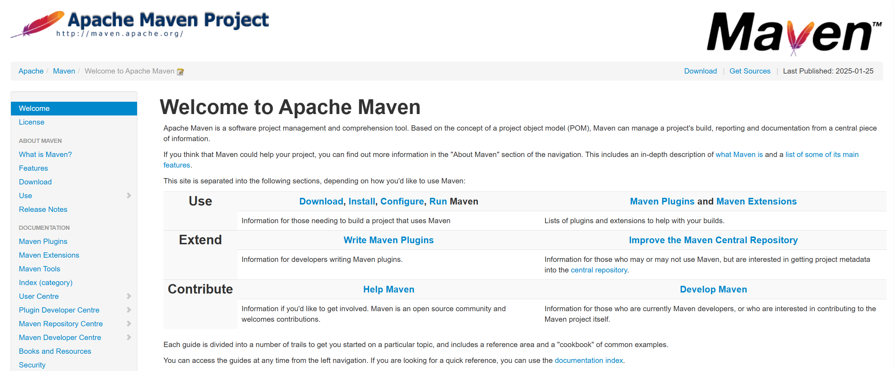
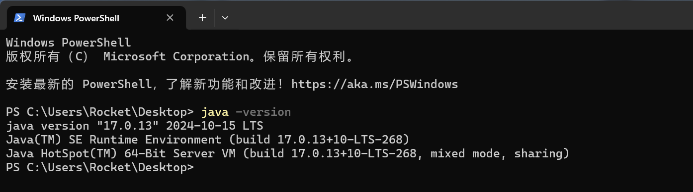
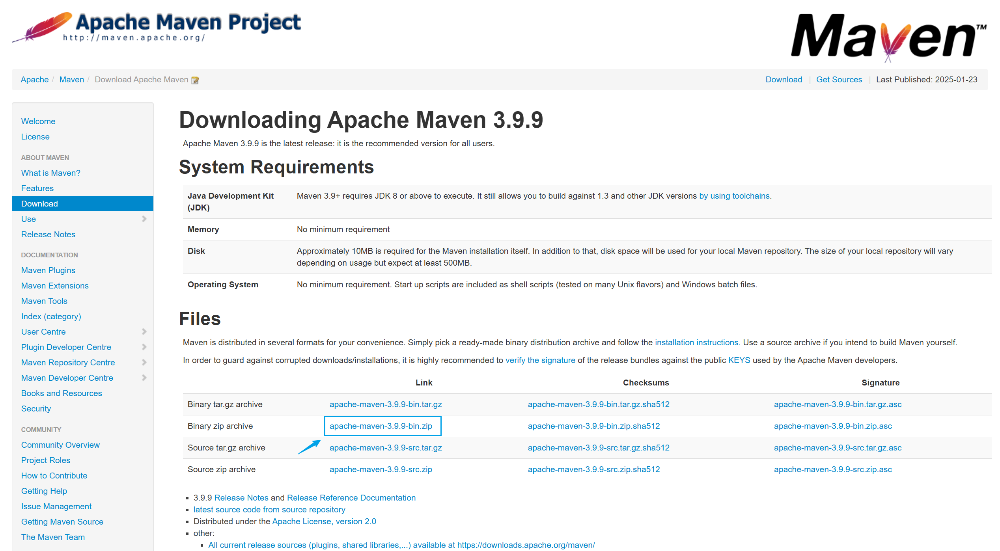
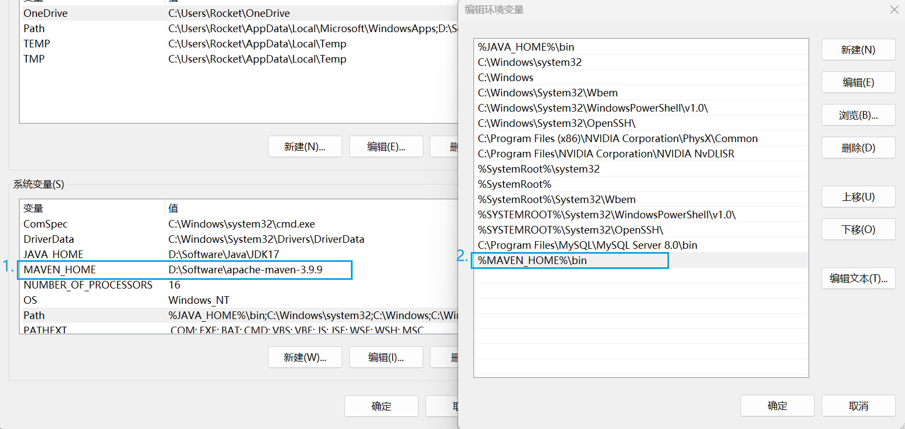
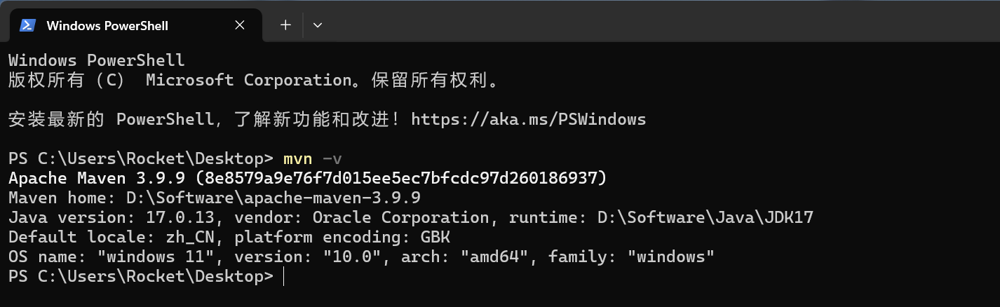

# Maven基础

## 1. Maven简介

Maven是一款用于管理和构建Java项目的工具，是Apache旗下的一个开源项目 。

Maven的核心功能有：

* **统一的项目结构**。

* **便捷的依赖管理**。
* **标准的项目构建**。

Maven官网：https://maven.apache.org/



## 2. Maven的安装

**Maven属于Java项目，需要Java运行环境，所以在安装Maven前确保已经安装了JDK。**



**前往Maven官网下载Maven免安装压缩包，解压到想要的目录。**



**配置Maven环境变量，以便在任意目录下使用Maven。**



**检验环境变量是否配置成功，在任意目录下输入`mvn -v`，如果正确显示版本信息，则配置成功。**



## 3. Maven的配置

### 3.1 Maven的仓库机制

Maven的配置主要是针对Maven仓库的配置，所以这里有必要介绍一下Maven的仓库机制。

依赖管理是Maven的核心功能之一，存储依赖的地方我们称之为仓库。Maven提供了三级仓库机制，这三级仓库分别是：

* **本地仓库**（即本地计算机上的一个目录）
* **远程仓库**（也叫私服，一般是由公司或团队搭建的私有仓库）
* **中央仓库**（由Maven官方维护的全球唯一的仓库）

当我们在项目中通过Maven引入一个外部依赖时，这三级仓库之间有一个查找的顺序：

**本地仓库** >>>> **远程仓库** >>>> **中央仓库**

即只有当上一级仓库中不存在需要的依赖时会去下一级仓库中查找，并且最终会把查找到的依赖下载到本地仓库，以便后续使用。

### 3.2 本地仓库配置

Maven默认的本地仓库是在当前用户目录下的/.m2/repository，我们可以修改为其他的地方。

打开Maven安装目录下的conf目录下的settings.xml文件，添加如下配置：

```xml
<localRepository>D:\mavenLocalRepository</localRepository>
```


### 3.3 远程仓库配置

由于中央仓库在国外，所以下载jar包速度可能比较慢，我们可以配置一个远程仓库以提高下载速度。

打开Maven安装目录下的conf目录下的settings.xml文件，在mirros标签中添加如下配置用来添加一个阿里云私服：

```xml
<mirror>
    <id>alimaven</id>
    <name>aliyun maven</name>
    <url>http://maven.aliyun.com/nexus/content/groups/public/</url>
    <mirrorOf>central</mirrorOf>
</mirror>
```


## 4. Maven的使用

关于如何使用Maven，在Maven的官网中有详细说明。


### 4.1 在命令行中使用

我们可以在命令行中通过Maven的相关命令实现项目的创建、编译、测试以及打包部署等项目构建流程，常用的Maven命令如下：

* `mvn archetype:generate`：创建Maven项目
* `mvn compile`：编译
* `mvn test`：测试
* `mvn package`：打包
* `mvn install`：将jar包安装到本地仓库
* `mvn clean`：删除上次编译的生成文件


### 4.2 在IDEA中使用

通过命令的方式使用Maven不够便捷高效，我们通常选择在开发工具中使用Maven。比如最主流的Java开发工具Intellij IDEA默认绑定了了Maven插件，我们也可以将IDEA中捆绑的Maven更换为自己在本地安装的Maven。

打开IDEA的全局设置，进入构建工具下的Maven设置目录，将Maven设置信息更换为自己安装的Maven：


这样，我们就可以在IDEA中以图形化界面的方式来使用Maven了。

比如，创建Maven项目只需要在新建项目的时候选择用Maven构建即可。


进入项目后，在IDEA右侧的Maven控制面板中，可以以图形化的方式实现对项目的构建管理。


## 5. Maven的核心功能

### 5.1 统一的项目结构

使用Maven创建的项目，具有统一的目录结构。例如，使用IDEA创建一个Maven项目，可以看到Maven自动帮我们创建了一份清晰的项目目录结构，而且在项目的根目录下有一份`pom.xml`文件，这是Maven针对该项目的核心配置文件。


事实上，Maven针对不同的开发场景，也提供了不同的项目原型（Archetype），但它们大体都遵循一个统一的目录结构。例如，这里我在创建项目的时候选择`maven-archetype-quickstart`模版。


创建项目后，可以看到在常规的目录结构下面，Maven又帮我们创建了用于快速入门的演示类，是不是很贴心。


### 5.2 便捷的依赖管理

在开发过程中，很多项目都依赖外部库或者框架，这些依赖通常是第三方开发的，例如常见的日志框架（如 Log4j）、数据库连接池（如 HikariCP）等等。Maven通过 **`pom.xml`** 文件来管理这些依赖项，并确保项目能够自动下载并正确引用所需的库。

#### 5.2.1 依赖的坐标

当我们需要在项目中导入某个依赖时，需要在**`pom.xml`** 文件中声明所需依赖的坐标。所谓依赖的坐标，指的就是可以唯一确定某个依赖的一组标签，它通常包含以下内容：

* **`groupId`**：依赖项所属的组织或公司标识。
* **`artifactId`**：依赖项的具体名称。
* **`version`**：依赖项的版本号。

例如，测试框架JUnit的坐标描述如下：

```xml
<dependency>
	<groupId>org.junit.jupiter</groupId>
    <artifactId>junit-jupiter</artifactId>
    <version>5.9.1</version>
</dependency>
```

如果不知道某个依赖的坐标信息，可以在网站：https://mvnrepository.com/中查找获得。


#### 5.2.2 依赖的导入

知道了依赖的坐标，导入依赖就很简单了，具体步骤为：

* 在**`pom.xml`** 文件中编写一对`dependencies`标签。
* 在`dependencies`标签中填入所需依赖的坐标。
* 点击IDEA界面右上角的刷新按钮，即可导入依赖。

注意，第一次导入某个依赖时，Maven会从远程/中央仓库下载并缓存到本地仓库，该过程需要联网进行。


#### 5.2.3 依赖的传递

依赖的传递是指我们在项目中导入某个库作为依赖时，它所依赖的库也会自动添加到项目中。在IDEA的Maven面板中，可以看到某个依赖项所传递下来的依赖。


如果我们确实不需要某个传递依赖，可以在声明依赖的时候采用下面这种方式进行依赖排除。


#### 5.2.4 依赖的作用域

Maven提供了多种依赖作用域，用于控制依赖在不同生命周期阶段的可见性和传递性。简单来讲就是我们可以通过设置依赖的作用域来限制依赖的使用范围。常见的依赖作用域有：

- **`compile`**：默认的作用域，表示依赖在项目的编译、测试和运行阶段都可用。
- **`provided`**：表示依赖在编译和测试阶段可用，但在运行时由容器或环境提供（如 Servlet API、JDBC 驱动等）。
- **`runtime`**：表示依赖在运行和测试阶段可用，但在编译阶段不可用。
- **`test`**：表示依赖只在测试阶段可用。

依赖的作用域是通过`scope`标签来定义的。例如，在引入JUnit测试框架时，可以这样声明：

```xml
<dependency>
	<groupId>org.junit.jupiter</groupId>
    <artifactId>junit-jupiter</artifactId>
    <version>5.9.1</version>
    <scope>test</scope>
</dependency>
```

声明Junit的作用域后，可以发现，只有在测试目录下才可以使用Junit。


### 5.3 标准的构建流程

#### 5.3.1 生命周期和阶段

Maven将项目的构建流程划分为了三套相互独立的构建生命周期，分别是：

- **`clean`**：这个生命周期用于清理上一次构建产生的文件。
- **`default`**：这个生命周期实现项目的编译、测试、打包、安装和部署等。
- **`site`**：这个生命周期用于生成报告、发布站点等。

每套生命周期都包含一些阶段，同一套生命周期内的各个阶段之间是有顺序的，后面阶段的执行依赖于前面阶段的执行。


#### 5.3.2 常执行的构建阶段

在构建流程的众多阶段中，我们只需要关注以下几个重要的阶段：

- **`clean`**：清理上一次构建生成的文件（属于clean生命周期）。
- **`compile`**：编译项目源代码（属于default生命周期）。
- **`test`**：进行单元测试（属于default生命周期）。
- **`package`**：将编译后的文件打包（属于default生命周期）。
- **`install`**：将打包后的项目安装到本地仓库（属于default生命周期）。

在IDEA的Maven控制面板中，也给我们列出了执行某些常用阶段的快捷方式：


当我们双击`package`时，Maven会依次执行前面的`validate`、`compile`和`test`，然后执行`package`，因为它们处于同一套构建生命周期。构建完成后，我们可以在项目的target目录下找到打好的JAR包：


当我们双击`clean`时，Maven只会执行clean生命周期中的`pre-clean`和`clean`，下面的各个阶段都不会被执行，因为它们不属于同一个生命周期。构建完成后，可以发现target目录被删除了：


#### 5.3.3 实现构建的插件

Maven对项目的构建是通过插件来实现的，插件定义了如何执行特定的构建任务。每个阶段的执行都可能涉及一个或多个插件。例如：

- **`maven-compiler-plugin`**：用于编译 Java 代码。
- **`maven-surefire-plugin`**：用于运行测试。
- **`maven-jar-plugin`**：用于创建 JAR 文件。

在IDEA的Maven控制面板中，也列出了项目构建用到的插件：


通过在 **`pom.xml`** 文件中配置插件，可以自定义构建过程。例如，下面是一个配置了 `maven-compiler-plugin` 插件的示例，用来指定 Java编译的版本，可以看到右侧插件列表发生了变化（compiler插件被替换为了自己配置的插件）：


## 6. Maven小结

Maven是一个强大的项目管理和构建工具，主要用于对Java项目的构建和依赖管理。Maven提供了一套仓库机制来实现对依赖的管理，并通过依赖的坐标进行依赖导入。Maven还提供了一系列用于项目构建的命令，将项目构建的整个流程划分为了三套独立的生命周期，项目构建的底层是通过插件来实现的，我们可以自定义构建使用的插件。
