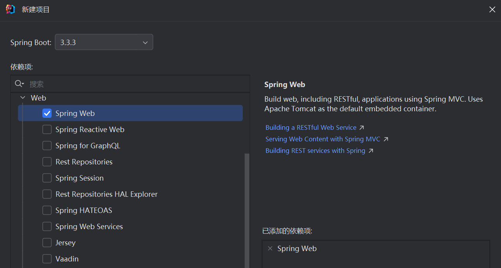

# Spring MVC

## 1. Spring MVC概述

Spring MVC是Spring框架的子模块，专门用于构建Web应用程序。

在了解Spring MVC之前，有必要先来了解一下什么是MVC。MVC是一种软件架构模式，该模式将应用程序分为模型（Model）、视图（View）、控制器（Controller）三个部分，通过控制器来协调模型和视图之间的交互，实现了业务逻辑和显示逻辑的分离。

早期的MVC是采用Servlet加JSP等模版引擎来实现的，即Servlet充当控制器，调用相关业务逻辑处理后，将产生的数据模型转交给JSP等模版引擎来进行渲染，并将最终的页面返回给浏览器进行展示。而现在主流的前后端分离开发中，我们常采用Spring MVC等MVC框架来替换掉Servlet，并与前端采用标准化的接口进行数据交互，这样开发起来更加省时省力。

## 2. Spring MVC核心架构

Spring MVC基于`DispatcherServlet`作为前端控制器，它负责接收用户的HTTP请求并将其转发给具体的处理组件。其工作流程如下：

**用户请求**：用户通过浏览器或客户端发起HTTP请求。

**请求映射**：Spring MVC的 `DispatcherServlet` 拦截所有的HTTP请求，根据URL、HTTP方法等信息将请求分派给对应的控制器。

**处理请求**：控制器接收到请求后，处理业务逻辑，调用业务逻辑层和数据访问层来获取或修改数据。

**返回响应**：控制器将处理结果返回，可能是视图名（返回页面）或直接返回JSON数据。

**视图解析**：如果返回视图名，`ViewResolver` 会根据名称查找对应的视图模板，渲染并生成最终的HTML或其他格式的内容响应。

## 3. Spring MVC配置

想在项目中使用Spring MVC，有两种方式：

* 使用Maven添加Spring MVC的依赖，并手动做一些配置。
* 使用Spring Boot创建项目，勾选Spring Web起步依赖。

很明显，使用第二种方式更简单，我们只需要在创建项目时勾选上Spring Web的起步依赖，Spring Boot便会自动帮我们配置好Spring MVC的相关环境（比如DispatcherServlet和Tomcat服务器的配置）：



## 4. 控制器Controller

在Spring MVC中，我们通过Controller类来接收请求，处理业务逻辑后返回响应，而不再是编写一个个Servlet了。Spring MVC为我们提供了一个DispatcherServlet作为前端控制器，所有的请求都由它来转发给相应的Controller。

我们可以使用`@Controller` 或者 `@RestController` 来定义一个控制器类，它们的主要区别在于对返回数据的处理方式不同。

当你在一个控制器方法上使用 `@Controller` 时，默认情况下，方法返回的值会被视为一个视图名称，并且Spring MVC会通过视图解析器（ViewResolver）找到对应的视图来进行渲染。通常与JSP, Thymeleaf等模板引擎一起使用。

而在前后端分离开发中，我们通常想返回纯文本或JSON数据，而不是视图。一种方式是使用`@ResponseBody`，它会告诉Spring MVC，不要将返回值解析为视图名，而是直接将它作为HTTP响应体返回。还有一种方式就是使用`@RestController`来定义这个控制器类，它相当于`@Controller` + `@ResponseBody`。

我们通常采用`@RestController`来声明一个控制器类，并通过`@RequestMapping`等注解来将请求路径映射到具体的处理方法上：

```java
@RestController
public class HelloController {
    @RequestMapping("/hello")
    public String hello() {
        return "Hello, SpringMVC~";
    }
}
```

## 5. 路径映射

路径映射指的就是用户发起的请求，怎么绑定到到Controller类中的方法上。在Spring MVC中，我们可以使用`@RequestMapping、@GetMapping、@PostMapping、@PutMapping、@DeleteMapping`等注解来实现路径映射。

### @RequestMapping

`@RequestMapping`可以放在类上或者方法上。如果放在类上，则该类中的每个方法的请求路径都要加上其声明的路径前缀：

```java
@RestController
@RequestMapping("/api")
public class HelloController {
    @RequestMapping("/hello")
	public String hello() {
        return "Hello, SpringMVC~"
    }
}
```

该Controller类中的hello方法的实际请求路径为http://localhost:8080/api/hello。

### @GetMapping

`@GetMapping`只能放在Controller类中的方法上，并且意味着该方法只能处理对应路径上的Get请求：

```java
@RestController
public class HelloController {
    @GetMapping("/hello")
	public String hello() {
        return "Hello, SpringMVC~"
    }
}
```

### @PostMapping

`@PostMapping`只能放在Controller类中的方法上，并且意味着该方法只能处理对应路径上的Post请求：

```java
@RestController
public class HelloController {
    @PostMapping("/hello")
	public String hello() {
        return "Hello, SpringMVC~"
    }
}
```

### @PutMapping

`@PutMapping`只能放在Controller类中的方法上，并且意味着该方法只能处理对应路径上的Put请求：

```java
@RestController
public class HelloController {
    @PutMapping("/hello")
	public String hello() {
        return "Hello, SpringMVC~"
    }
}
```

### @DeleteMapping

`@DeleteMapping`只能放在Controller类中的方法上，并且意味着该方法只能处理对应路径上的Delete请求：

```java
@RestController
public class HelloController {
    @DeleteMapping("/hello")
	public String hello() {
        return "Hello, SpringMVC~"
    }
}
```

### 路径映射注解小结

* `@RequestMapping`可以加在类上或者方法上，加在类上代表前缀路径。
* `@RequestMapping`可以用来处理任何HTTP请求，也可以通过method属性限定它能处理的请求。
* `@GetMapping、@PostMapping、@PutMapping、@DeleteMapping`只能加在方法上，并且只能处理对应的请求。

## 6. 参数接收

我们可以像Servlet那样，通过HttpServletRequest对象手动获取请求参数，但在Spring MVC中，有更简便的方式。我们可以直接在方法中声明对应的形参来接收请求参数，不过前提是要实现方法形参和请求参数的正确映射，Spring MVC提供了几种注解来实现这一点。

下面是几种不同的请求参数的接收方式：

### 查询参数接收

对于通过URL传递的简单查询参数，比如http://localhost/user?name=tom&age=18中问号后面跟着的两个参数，我们可以直接在Controller方法的形参中声明这样两个变量，让形参名与请求参数名一致，即可完成自动接收：

```java
@RequestMapping("/simpleParam")
public String getParam(String name, int age) {
	System.out.println(name + ":" + age);
    return "ok";
}
```

必要时，我们可以在Controller方法的形参中声明一个对象来接收多个查询参数，只要让对象的属性名与请求参数名一样，即可完成自动接收：

```java
@RequestMapping("/simpleParam")
public String getParam(User user) {
	System.out.println(user);
    return "ok";
}
```

```java
public class User {
    private String name;
    private int age;
    
    //get set方法
}
```

除了让Conrtroller方法的形参名与请求参数名保持一致来实现自动接收外，我们还可以通过`RequestParam`注解来手动指定它们之间的映射关系，比如下面这样：

```java
@RequestMapping("/simpleParam")
public String getParam(@RequestParam(name = "name") String username, int age) {
	System.out.println(username + ":" + age);
    return "ok";
}
```

关于`@RequestParam`注解，还有两个比较常用的属性：

* required：默认是true，代表必须传递该参数，如果没有，则返回错误信息。
* defaultValue：用来声明该形参的默认值，如果没有接收到该参数，则使用默认值。

### JSON参数接收

对于请求体中传递过来的JSON数据，我们需要在Controller方法的形参中声明一个对象，并添加上`@RequestBody`注解，表示该形参用于接收请求体中的数据：

```java
@RequestMapping("/jsonParam")
public String getParam(@RequestBody User user) {
	System.out.println(user);
    return "ok";
}
```

### 文件参数接收

对于请求体中传递过来的文件，Spring MVC提供了一个MultiPartFile类型的变量进行接收，我们只需要在Controller方法中声明这样一个形参即可完成文件的接收：

```java
@RequestMapping("/fileParam")
public String getParam(MultiPartFile file) {
	System.out.println(file);
    return "ok";
}
```

### 路径参数

包含在请求路径中的参数叫做路径参数，在路径映射的注解中，我们用{...}来标识一个路径参数，接收路径参数需要在Controler方法的形参中使用`@PathVariable`注解：

```java
@RequestMapping("/pathParam/{id}")
public String getParam(@PathVariable int id) {
	System.out.println(id);
    return "ok";
}
```

### 日期参数

对于日期参数，需要使用`@DateTimeFormat`注解来完成日期参数的格式转换：

```java
@RequestMapping("/dateParam")
public String getParam(@DateParamFormat(pattern = "yyyy-MM-dd HH:mm:ss") LocalDateTime time) {
	System.out.println(time);
    return "ok";
}
```

## 7. 返回数据

我们前面讲到过，只使用`@Controller`注解标记的控制器类，默认返回的是一个视图，而加上`@ResponseBody`注解或者索性直接使用`@RestController`注解标记的控制器类返回的数据会被直接当作响应体返回，即如果Controller返回的是一个字符串，则直接返回，如果Controller返回的是一个对象，则会被转为JSON格式的数据再返回。

由于前后端分离开发是现在的主流，所以我们主要讨论Spring MVC框架如何返回不同的数据而不是视图。

下面是几种不同的返回数据的方式：

### 返回字符串

在 `@ResponseBody` 注解或 `@RestController`注解的作用下，我们可以直接返回一个字符串，Spring MVC会将字符串直接作为响应体：

```java
@RestController
public class HelloController {
    @RequestMapping("/hello")
	public String hello() {
        return "Hello, SpringMVC~" //字符串直接作为响应体
    }
}
```

### 返回Json数据

同样在 `@ResponseBody` 注解或 `@RestController`注解的作用下，我们可以返回一个对象，Spring MVC会通过消息转换器（如 `Jackson` 或 `Gson`）将Java对象序列化为 JSON 或 XML，然后作为响应体返回：

```java
@RestController
public class UserController {
    @RequestMapping("/getUser")
	public User getUser() {
        User user = new User("rocketBear", 18);
        return user; //序列化为JSON作为响应体
    }
}
```

### 返回统一响应结果

在前后端分离开发中，前端需要解析和处理后端响应回来的数据，我们发现后端的Spring MVC框架既可以返回字符串，又可以返回JSON，而且没有统一的格式，这对前端的开发很不便利，所以我们有必要设计一个统一的响应结果。

通常，统一的响应结果的格式应该包含三个关键字段：

- **状态码（code）**：指示请求是成功还是失败。
- **消息（message）**：提供额外的描述信息。
- **数据（data）**：包含实际业务数据。

比如，一个标准的响应结果大概像下面这样：

```json
{
    "code": 1,
    "message": "success",
    "data": {
        "name": "rocketBear",
        "age": 18
    }
}
```

我们可以定义一个Result类用于封装统一响应结果，它应该设计为一个泛型类，因为我们返回的数据类型并不确定，可能返回一个User对象，也可能返回一个List集合对象：

```java
public class Result<T> {
    //响应码，比如1代表成功，0代表失败
    private Integer code;
    //提示信息
    private String message;
    //实际业务数据
    private T data;

    //私有构造函数，使用静态方法创建实例
    private Result(Integer code, String message, T data) {
        this.code = code;
        this.message = message;
        this.data = data;
    }

    //成功的静态工厂方法，返回带有数据的成功结果
    public static <T> Result<T> success(T data) {
        return new Result<>(1, "操作成功", data);
    }

    //成功的静态工厂方法，返回不带数据的成功结果
    public static <T> Result<T> success() {
        return new Result<>(1, "操作成功", null);
    }

    //失败的静态工厂方法，自定义失败信息
    public static <T> Result<T> error(String message) {
        return new Result<>(0, message, null);
    }

    //Getter和Setter方法
    public Integer getCode() {
        return code;
    }

    public void setCode(Integer code) {
        this.code = code;
    }

    public String getMessage() {
        return message;
    }

    public void setMessage(String message) {
        this.message = message;
    }

    public T getData() {
        return data;
    }

    public void setData(T data) {
        this.data = data;
    }
}
```

这样，在我们的Controller方法中，就可以返回统一的Result类了，Spring MVC会将它转为JSON后作为响应体返回给前端：

```java
@RestController
public class UserController {

    @GetMapping("/user")
    public Result<User> getUser() {
        User user = new User("rocketBear", 18);
        return Result.success(user);
    }

    @GetMapping("/users")
    public Result<List> getUsers() {
        return Result.error("查询失败");
    }
}
```

## 8. 常用注解总结

- **@Controller：**标记在一个类上，表明这个类是Spring MVC的Controller。
- **@RestController：**是`@Controller`和`@ResponseBody`的组合注解，表示该类中的所有方法都会返回数据给客户端，而不是视图名称。
- **@ResponseBody：**表示该方法的返回值应该绑定到Web响应体上。
- **@RequestMapping：**用于映射请求URL到处理器方法。
- **@GetMapping、@PostMapping等：**HTTP请求方法的快捷注解。
- **@RequestParam：**用于将请求参数绑定到控制器方法的参数上。
- **@RequestBody：**用于将请求体中的数据绑定到控制器方法的参数上。
- **@PathVariable：**用于将URL模板变量绑定到控制器方法的参数上。

## 9. Spring MVC小结

Spring MVC是一个功能强大且灵活的Web开发框架，它通过清晰的分层结构、灵活的注解机制，简化了Web应用程序的开发过程，尤其是在开发RESTful API时非常高效，RESTful API就是一种以HTTP协议作为前后端通信方式的接口设计。

Spring MVC通过前端控制器DispatcherServlet将前端发送来的HTTP请求转发至对应的Controller方法上。

在基于RESTful API的前后端分离开发中，SpringMVC提供了`@RestController`注解用来实现JSON数据的返回，针对不同的HTTP请求方法，Spring MVC提供了`@GetMapping、@PostMapping、@PutMapping、@DeleteMapping`等注解来实现路径的映射，还提供了`@RequestParam、@RequestBody、@PathVariable`等注解用来接收与绑定请求参数。

在Spring MVC开发模式下，我们把Controller中的每一个方法都称作一个API接口。前后端会提前约定好接口的请求路径、请求参数以及需要响应的参数，产生接口文档，后端只需要针对接口文档进行接口的开发即可，非常的方便。
